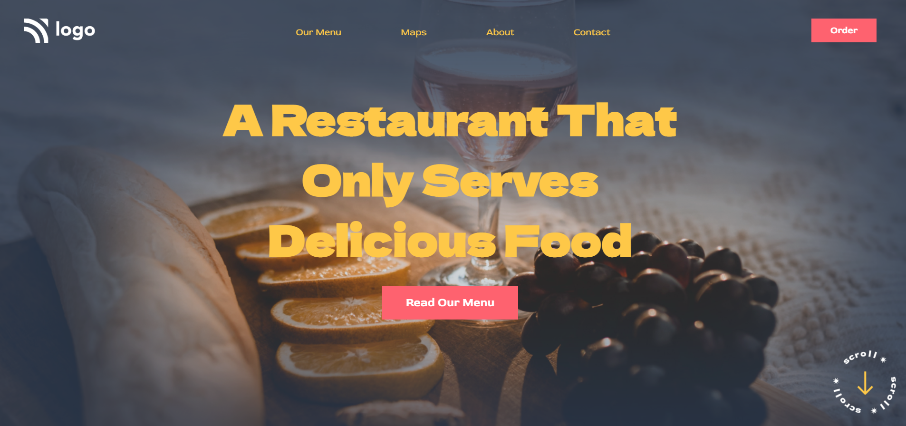

# **Food Restaurant Home Page**

>By Subrata

-----
#### Live Deployed Website : [here](https://streets-landingpage.netlify.app/)

---
### What I learned from this Project?

- This project was a very good learning experience for me.
- I learned how to use css position(Relative & Absolute & fixed) property.
- I learned about box-shadow, and diffrent type of font-family
- I learned about background image property .

---
#### How the website looks ike
---

***

